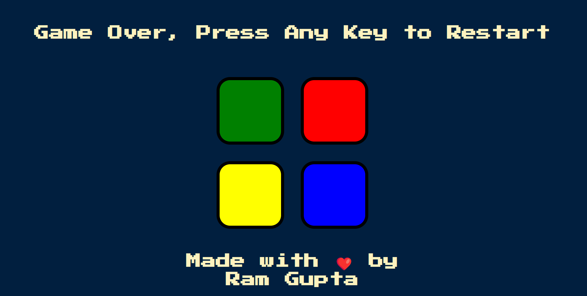

# Simon Game

## Description

A simon Game made using HTML,CSS,JavaScript, JQuery. 

Here's how the game typically works:
The game has four colored buttons, each producing a particular tone when pressed.
The game randomly generates a sequence of tones and lights corresponding to the buttons, which the player must replicate.
The sequence starts with one tone and light, then increases in length as the game progresses.
After each successful repetition of the sequence, the game adds another tone and light to the end of the sequence.
If the player fails to repeat the sequence correctly, the game ends, and the player's score is displayed.

## Live Demo 
https://ramg222.github.io/JS_JQuery-Simon-Game/

## Contact 
GitHub profile :- https://github.com/RamG222 Email :- shriramgupta8141@gmail.com Website :- https://RamApp.dev/

## Screenshot

## Video 
https://www.youtube.com/watch?v=MmVC1qI4C4w&ab_channel=RamGupta